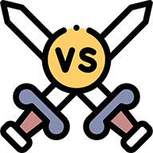

<h1 align="center">
    Versus
     
</h1>

    <strong>🏆&nbsp; A stress-free project to try out some concepts and maybe get rid of few bad habits. &nbsp;🏆 </strong>

    
    
     
     

  

This project plays with several technologies that are around for some time, but I never managed to try them out, [GitHub Pages](https://pages.github.com/) and [GitHub Actions](https://github.com/features/actions).
It uses concept of self updating repository, since workflows will be triggered on new open issues and updated the repository and pages respectively.
Project also uses [React](https://reactjs.org/), [Semantic UI](https://react.semantic-ui.com/) and [React GH Pages](https://github.com/gitname/react-gh-pages) (to build _React_ app for _GitHub Pages_). 
[Python](https://www.python.org/) is also used for a bit of scripting (what else 😉).

## Contenders

### Snooze Button

Arch-nemesis in the last couple of years, so it's finally time to get rid of it. Game rules are as follows:
- 1 point each time I wake up without using the snooze button.
- -1 point for each time I use snooze button

Since it happens, snooze button can be used multiple times, so a bit of help in final score can be obtained as follows:
- 2 points for each supporter
- -2 points for each supporter of **Snooze button** (fair game)
- 5 points for starring the repo (🔧 TODO)

Supporting is done through creating issues in special format, or just following links:
- [support me](https://github.com/stkeky/versus/issues/new?title=vs1%7Cstkeky&body=%3C%21--%20Please%20leave%20a%20comment%20and%20click%20the%20%27Submit%20new%20issue%27.%20--%3E)
- [support snooze button](https://github.com/stkeky/versus/issues/new?title=vs1%7Csnooze&body=%3C%21--%20Please%20leave%20a%20comment%20and%20click%20the%20%27Submit%20new%20issue%27.%20--%3E)

Once issue is submitted, workflow will trigger, results will be updated and could be seen
[here](https://stkeky.github.io/versus/snooze).

---

<a href="https://www.flaticon.com/free-icons/versus" title="versus icons">Versus icons created by Freepik - Flaticon</a>